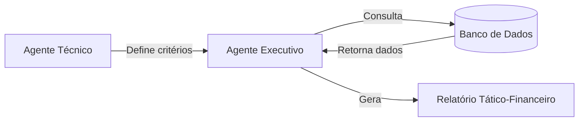

# ⚽ ScoutAI - Sistema Multi-agentes de Scouting de Futebol


## 👨🏻‍💻 Sobre o Projeto

Projeto desenvolvido para praticar habilidades em:
- **Automação de processos** com multi-agentes inteligentes
- **Análise de dados** sob restrições financeiras
- **Integração entre** critérios técnicos e realidade de mercado

## 📌 Visão Geral

O ScoutAI é um sistema de recomendação de jogadores que combina análise técnica e financeira para auxiliar clubes sul-americanos no mercado de transferências. Através de agentes IA especializados, o sistema:

- Interpreta requisitos táticos do corpo técnico
- Cruza com dados reais de desempenho e valor de mercado
- Recomenda os jogadores que melhor atendem aos critérios dentro do orçamento disponível

## 🏗️ Arquitetura do Sistema


## 👨‍💼 Agentes e seus Papéis
### Agente técnico
Responsabilidade: Traduzir necessidades táticas em critérios mensuráveis

Tomada de Decisão:

- Define atributos ideais por posição (ex.: altura mínima para zagueiros)

- Estabelece níveis de desempenho aceitáveis (rating, gols, assistências)

- Considera características do esquema tático (ex.: Zagueiro com participação ofensiva)

### Agente Executivo
Responsabilidade: Operacionalizar os critérios técnicos dentro de restrições financeiras

Fluxo de Trabalho:

- Recebe os filtros do Agente Técnico;
- Converte em queries SQL otimizadas;
- Aplica camada de análise financeira;
- Gera relatório com as 3 melhores jogadores opções por posição com justificativa;

# Frameworks e Pacotes
| Tecnologia | Aplicação |
| --- | --- |
| CrewAI | Framework para criação e coordenação dos agentes|
| SQLite | Armazenamento e consulta dos dados de jogadores |

# Fonte de dados
- API Football Data: Estatísticas de desempenho
- Transfermarkt: Valores de mercado e informações complementares


# Entrada do sistema
O parâmetros é definido na TASK `negotiation.py` tribuida ao técnico, que sugere atletas que se encaixem no perfil

```
1. **Goleiro**: 
   - Rating >=6.0
   - Altura >190cm 
   - Valor máximo: €300.000 (transferValue < 300000)

2. **Zagueiro**: 
   - Altura >=185cm
   - Rating >5.6
   - Gols >=1
   - Valor máximo: €400.000 (transferValue < 400000)

3. **Meia**: 
   - Rating >6.5
   - Cartões vermelhos <2
   - Assistências >=2
   - Valor máximo: €450.000 (transferValue < 450000)

4. **Atacante**: 
   - Rating >6.9
   - Gols >3
   - Valor máximo: €500.000 (transferValue < 500000)
   - Idade <34 anos
```


# Saida do sistema
Relatório Gerado (`report.md`):

```
### 🧤 Goleiro
- **Nome:** Alisson  
  **Idade:** 29  
  **Altura:** 190 cm  
  **Rating:** 8.31  
  **Valor:** €100.000  
- **Justificativa:** Alisson é um goleiro com alto rating e excelente presença na área, ideal para manter a segurança defensiva.

### ⚽ Atacante
- **Nome:** Carlao  
  **Idade:** 32  
  **Altura:** 185 cm  
  **Rating:** 7.27  
  **Valor:** €200.000  
- **Justificativa:** Carlao é um atacante experiente que pode trazer eficácia ao ataque, sempre contribuindo com gols.
...
```

____

# The end

Projeto desenvolvido por Reyso Teixeira como parte do portfólio em Ciência/Analise de Dados.