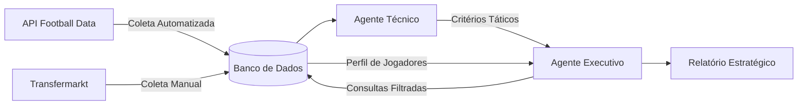

# ⚽ ScoutAI - Sistema Multi-agentes de Scouting de Futebol


## 👨🏻‍💻 Sobre o Projeto


Projeto  desenvolvido para praticar habilidades em automação com agentes inteligentes, tratamento e análise de dados. Simula um sistema  de scouting para clubes sul-americanos.

<!-- - **Critérios táticos** do corpo técnico  
- **Restrições financeiras** da diretoria  
- **Dados reais** de desempenho e mercado -->

## 🚀 Overview



```mermaid
flowchart TD
    subgraph Coleta
        A1[API Fotmob (RapidAPI)] -->|Coleta automatizada\n(`requests`)| B[SQLite DB: data_fute.db]
        A2[Transfermarkt (futuro)] -->|Possível coleta adicional| B
    end

    subgraph Banco de Dados
        B --> T1[Tabela teams]
        B --> T2[Tabela players]
    end

    subgraph Inteligência
        T3[Tools (`PlayerScoutTool`)] -->|Acesso com filtros| E2
        T3 -->|via `tools.database_tool`| E1
    end

    subgraph CrewAI
        D[Agente Técnico] -->|Define critérios\n(filtros por posição)| CTX[🧠 Contexto compartilhado]
        CTX --> E[Agente Executivo]
        E -->|Consulta Tools com filtros| T3
        E1[ScoutGoleiros / Defensores...] --> B
        E2 --> F[📋 Relatório Estratégico\n`report.md`]
    end

```


O ScoutAI é um sistema de recomendação de jogadores que combina análise técnica e financeira para auxiliar clubes sul-americanos no mercado de transferências. Através de agentes IA especializados, o sistema:

- Interpreta requisitos táticos do corpo técnico
- Cruza com dados reais de desempenho e valor de mercado
- Recomenda os jogadores que melhor atendem aos critérios dentro do orçamento disponível

# 📋 Estrutura do Projeto
```
ScoutAI-Agents/
├── agents/
│   ├── coach.py       # AI Agents Técnico de futebol
│   └── executive.py   # AI Agents Executivo de futebol
├── database/
│   └── data_fute.db   # Banco SQLite
├── tools/
│   └── database_tool.py # Tool para Consultas SQL
├── tasks/
│   └── negotiation.py   # Task para os AI Agents
└── main.py            # Pipeline principal

```


## 👨‍💼 Agentes e seus Papéis
### Agente técnico
Responsabilidade: Traduzir necessidades táticas em critérios mensuráveis

Tomada de Decisão:

- Define atributos ideais por posição (ex.: altura mínima para zagueiros)

- Estabelece níveis de desempenho aceitáveis (rating, gols, assistências)

- Considera características do esquema tático (ex.: Zagueiro com participação ofensiva)

### Agente Executivo
Responsabilidade: Operacionalizar os critérios técnicos dentro de restrições financeiras

Fluxo de Trabalho:

- Recebe os filtros do Agente Técnico;
- Converte em queries SQL otimizadas;
- Aplica camada de análise financeira;
- Gera relatório com as 3 melhores jogadores opções por posição com justificativa;

# ⚙️ Tecnologias Utilziadas
| Tecnologia | Aplicação |
| --- | --- |
| Python | Scrips e implementação|
| CrewAI | Framework para criação e coordenação de sistemas multiagentes|
| Chagpt 4.0 nano | Modelo de LLM responsável pela tomada de decisão dos agentes |
| PlayerScoutTool | Tool desenvolvida para conexão e query no banco de dados|
| SQLite | Armazenamento e consulta dos dados de jogadores |


# 🛢 Fonte de dados/ Banco de dados e estrutura
Pode conferir o banco de dados utilziado em `database\data_fute.db` desenvolvido em sqlite3.
### API Football Data
- Estatísticas de desempenho
- Cobertura da Séries A/B/C do Brasil + Ligas Argentina/Bolívia/Paraguai
### Transfermarkt
- Valores de mercado atualizados
### Estrutura do Banco de Dados
 - Tabela players com 15 atributos por jogador  

--- 

# 📥 Entrada do sistema
O parâmetro é definido na TASK `negotiation.py` tribuida ao técnico, que sugere atletas que se encaixem no perfil

```
1. **Goleiro**: 
   - Rating >=6.0
   - Altura >190cm 
   - Valor máximo: €300.000 (transferValue < 300000)

2. **Zagueiro**: 
   - Altura >=185cm
   - Rating >5.6
   - Gols >=1
   - Valor máximo: €400.000 (transferValue < 400000)

3. **Meia**: 
   - Rating >6.5
   - Cartões vermelhos <2
   - Assistências >=2
   - Valor máximo: €450.000 (transferValue < 450000)

4. **Atacante**: 
   - Rating >6.9
   - Gols >3
   - Valor máximo: €500.000 (transferValue < 500000)
   - Idade <34 anos
```


# 📤Saida do sistema  
⚠️ Veja o Relatório Final Gerado em (`report.md`)⚠️

```
### 🧤 Goleiro
- **Nome:** Alisson  
  **Idade:** 29  
  **Altura:** 190 cm  
  **Rating:** 8.31  
  **Valor:** €100.000  
- **Justificativa:** Alisson é um goleiro com alto rating e excelente presença na área, ideal para manter a segurança defensiva.

### ⚽ Atacante
- **Nome:** Carlao  
  **Idade:** 32  
  **Altura:** 185 cm  
  **Rating:** 7.27  
  **Valor:** €200.000  
- **Justificativa:** Carlao é um atacante experiente que pode trazer eficácia ao ataque, sempre contribuindo com gols.
...
```

____

# 🌐 Contato

Para dúvidas ou colaborações, sinta-se a vontade em me contatar:

- Author: Reyso Teixeira
- GitHub: [Reyso](https://github.com/Reyso)
- LinkedIn: [Reyso Teixeira](https://www.linkedin.com/in/reyso-teixeira/)
- Website: [Pagina de portifólio](https://reyso.github.io/portifolio_projetos)
