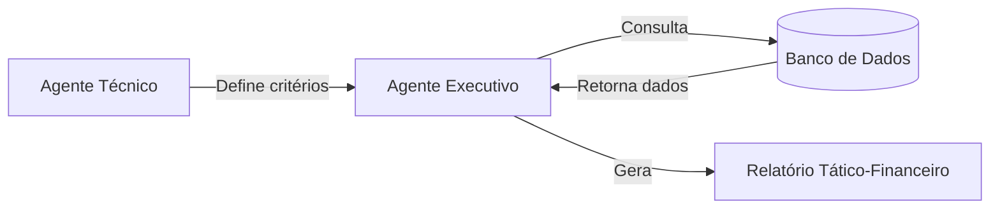

# ⚽ ScoutAI - Sistema Multi-agentes de Scouting de Futebol

## 👨🏻‍💻 Sobre o Projeto

Projeto desenvolvido para praticar habilidades em:
- **Automação de processos** com multi-agentes inteligentes
- **Análise de dados** sob restrições financeiras
- **Integração entre** critérios técnicos e realidade de mercado

## 📌 Visão Geral

O ScoutAI é um sistema de recomendação de jogadores que combina análise técnica e financeira para auxiliar clubes sul-americanos no mercado de transferências. Através de agentes IA especializados, o sistema:

- Interpreta requisitos táticos do corpo técnico
- Cruza com dados reais de desempenho e valor de mercado
- Recomenda os jogadores que melhor atendem aos critérios dentro do orçamento disponível

## 🏗️ Arquitetura do Sistema

## 👨‍💼 Agentes e seus Papéis
### Agente técnico
Responsabilidade: Traduzir necessidades táticas em critérios mensuráveis

Tomada de Decisão:

- Define atributos ideais por posição (ex.: altura mínima para zagueiros)

- Estabelece níveis de desempenho aceitáveis (rating, gols, assistências)

- Considera características do esquema tático (ex.: Zagueiro com participação ofensiva)

### Agente Executivo
Responsabilidade: Operacionalizar os critérios técnicos dentro de restrições financeiras

Fluxo de Trabalho:

- Recebe os filtros do Agente Técnico;
- Converte em queries SQL otimizadas;
- Aplica camada de análise financeira;
- Gera relatório com as 3 melhores jogadores opções por posição com justificativa;

#